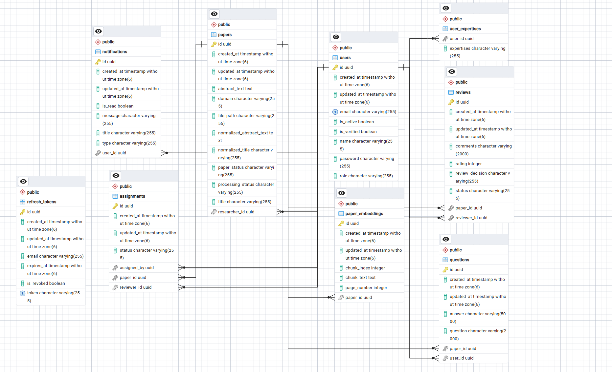
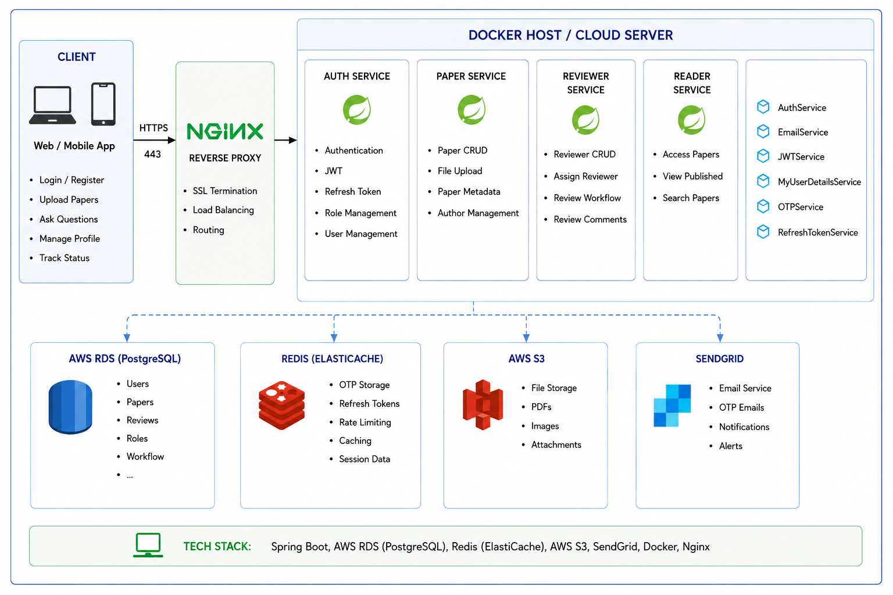
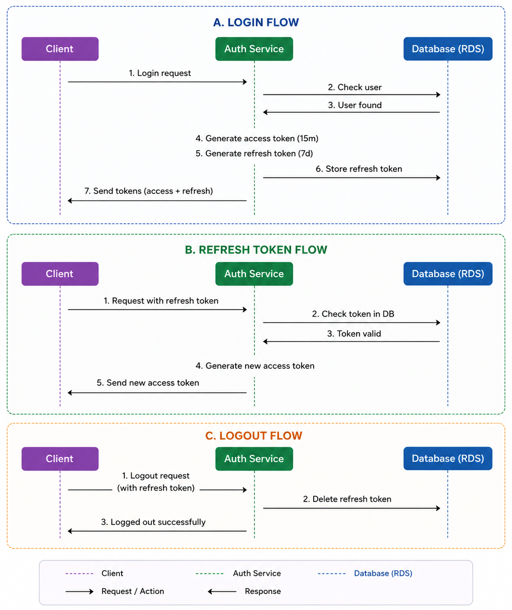
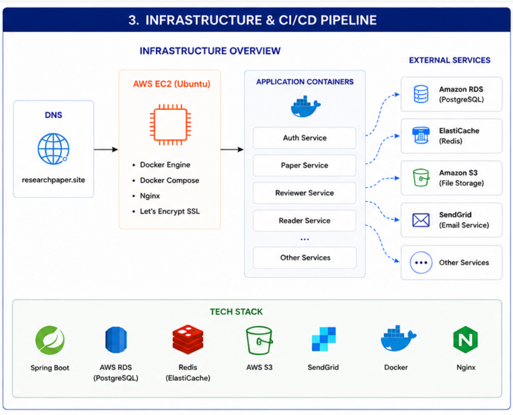
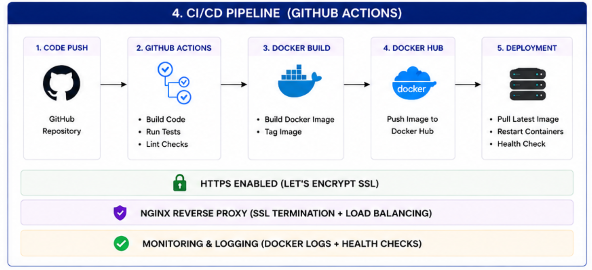
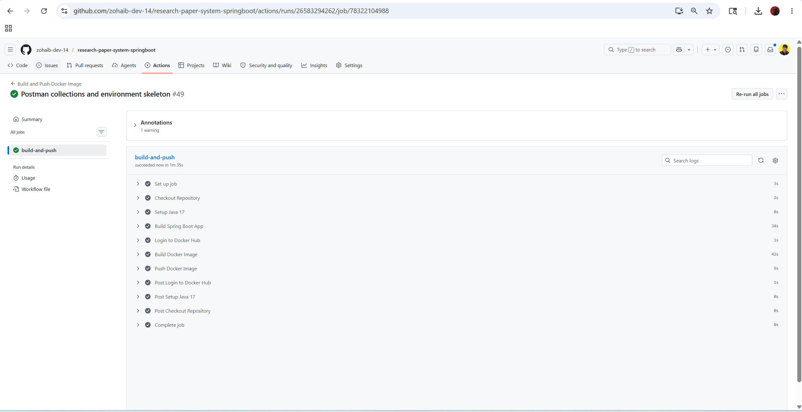
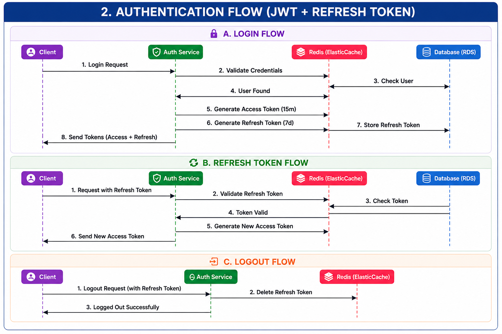
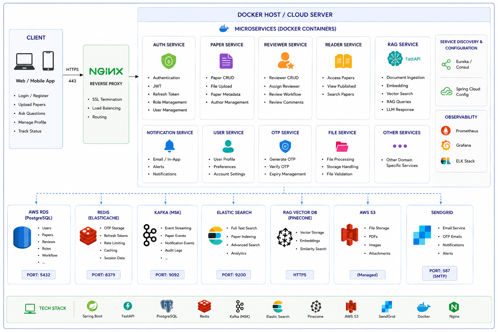

# 🔬 Cloud-Native Research Paper Management System

A production-oriented backend system for managing research paper submissions, review workflows, secure authentication, role-based access control, cloud-based file storage, and automated deployment pipelines.

The project was built to explore how modern backend systems work in real production environments using Spring Boot, Docker, AWS Cloud Services, Nginx Reverse Proxy, HTTPS Security, CI/CD automation, and distributed infrastructure.

---

# 🌐 Live Production Demo

## Swagger API Documentation

```txt
https://researchpaper.site/swagger-ui.html
```

---

## Production Domain

```txt
https://researchpaper.site
```

---

## Cloud Deployment

- Hosted on AWS EC2
- HTTPS enabled using Let's Encrypt SSL
- Nginx Reverse Proxy configured
- Dockerized Production Deployment
- CI/CD automated using GitHub Actions

---

# 2. 🎯 PURPOSE

This project is a backend system for managing research papers and review workflows.

The system allows users to:

- Upload research papers
- Assign reviewers
- Review and manage papers
- Track workflow states
- Manage secure authentication
- Upload files to cloud storage
- Access role-based APIs
- Deploy production-ready backend infrastructure

The main purpose of this project was to learn how real backend systems are built, secured, deployed, and managed in cloud environments.

---

# 3. ❓ WHY THIS PROJECT?

The goal of this project was to explore real-world backend engineering concepts instead of building only basic CRUD applications.

This project focuses on:

- Secure Authentication
- REST API Development
- JWT & Refresh Token Systems
- Role-Based Access Control (RBAC)
- Dockerized Deployment
- CI/CD Pipelines
- AWS Cloud Infrastructure
- Reverse Proxy Configuration
- HTTPS Security
- Redis Caching
- Cloud File Storage
- Production Deployment
- Distributed Backend Systems

---

# 4. 🚀 Features

- JWT Authentication
- Refresh Token System
- Role-Based Access Control (RBAC)
- OTP Email Verification
- SendGrid Email Integration
- Redis Caching
- AWS S3 File Storage
- Dockerized Deployment
- Nginx Reverse Proxy
- HTTPS with Let's Encrypt
- GitHub Actions CI/CD
- PostgreSQL Database
- OpenAPI / Swagger Documentation
- Reviewer Assignment Workflow
- Secure REST APIs
- Research Paper Lifecycle Management
- Cloud-Native Deployment
- Production Environment Configuration
- Docker Hub Image Deployment

---

# 5. 🛠️ Tech Stack

## Backend

- Spring Boot
- Spring Security
- Spring Data JPA
- Hibernate

---

## Authentication & Security

- JWT Authentication
- Refresh Tokens
- BCrypt Password Encryption
- Spring Security
- Role-Based Access Control (RBAC)
- OTP Verification

---

## Database & Cache

- PostgreSQL
- Redis Cache

---

## Cloud & Infrastructure

- AWS EC2
- AWS RDS
- AWS S3
- AWS ElastiCache

---

## DevOps & Deployment

- Docker
- Docker Compose
- Docker Hub
- Nginx Reverse Proxy
- GitHub Actions CI/CD
- Let's Encrypt SSL

---

## API Documentation

- Swagger UI
- OpenAPI

---

## Email Services

- SendGrid
- Domain Authentication
- SPF / DKIM Configuration

---

## Build Tool

- Maven

---

# 6. 🧠 Core Engineering Concepts Explored

- Stateless Authentication
- Distributed Cloud Infrastructure
- Secure API Design
- Workflow State Management
- Dockerized Deployment
- CI/CD Automation
- Reverse Proxy Configuration
- HTTPS Security
- DNS Configuration
- SPF / DKIM Email Verification
- Secure File Upload Handling
- Multi-Role Workflow Systems
- Cloud Storage Integration
- Production Infrastructure Management

---

# 7. 📝 Workflow Management System

Implemented a complete paper review workflow:

```txt
SUBMITTED
   ↓
UNDER_REVIEW
   ↓
ACCEPTED / REJECTED
   ↓
REVISION
```

---

# 8. 👨‍🔬 Researcher Features

- Upload research papers securely
- Track paper submission status
- View uploaded papers with pagination
- Manage personal submissions
- Receive workflow updates
- Access researcher-only endpoints

---

# 9. 👨‍💼 Admin Features

- Review submitted research papers
- Approve or reject papers
- Assign reviewers based on expertise
- Manage workflow states
- Access admin-only endpoints
- Manage review assignments

---

# 10. 👨‍🏫 Reviewer Features

- View assigned papers
- Submit reviews and ratings
- Participate in review workflows
- Access reviewer-authorized APIs

---

# 11. 📚 Reader Features

- Access approved research papers
- Read published papers
- View public research documents

---

# 12. 🏗️ Project Structure

```txt
src/main/java/com/zabisoft/research_paper_system/

├── config/         # Security, Redis, AWS, Swagger Configurations
├── controller/     # REST API Controllers
├── dto/            # Request & Response DTOs
├── entities/       # Database Entity Classes
├── enums/          # Roles, Status & Workflow Enums
├── exception/      # Global Exception Handling
├── filter/         # JWT Authentication Filters
├── helper/         # Helper Classes
├── interfaces/     # Service Interfaces
├── principal/      # Custom User Principal
├── repositories/   # Spring Data JPA Repositories
├── response/       # Custom API Response Models
├── seeder/         # Admin Seeder & Initial Data
├── service/        # Business Logic Layer
└── util/           # Utility Classes
```

---

# 13. 🔐 Authentication & Security

## Security Features

- JWT Authentication
- Refresh Token System
- Role-Based Access Control (RBAC)
- Secure Password Encryption using BCrypt
- Stateless Authentication
- Spring Security Integration
- Protected REST APIs
- Custom JWT Authentication Filter
- OTP Email Verification
- Secure Token Validation

---

## User Roles

- ADMIN
- RESEARCHER
- REVIEWER
- READER

---

## Authentication Flow

```txt
User Login
    ↓
JWT Access Token Generated
    ↓
Protected API Access
    ↓
Access Token Expired
    ↓
Refresh Token Generates New Access Token
```

---

# 14. 🏗️ Project Architecture

## Architecture Flow

```txt
Client
   ↓
Domain (researchpaper.site)
   ↓
Nginx Reverse Proxy
   ↓
Spring Boot REST APIs
   ↓
Security Layer
   ↓
Service Layer
   ↓
Repository Layer
   ↓
PostgreSQL / Redis / AWS S3
```

---
## ERD OF RESEARCH PAPER SYSTEM

# Workflow Status Enums

## Paper Status
- SUBMITTED
- UNDER_REVIEW
- ACCEPTED
- REJECTED
- REVISION

## Processing Status
- UPLOADED
- PROCESSING
- COMPLETED

## User Roles
- ADMIN
- RESEARCHER
- REVIEWER
- READER


# 14-a. ERD FOR CLOUD-NATIVE RESEARCH PAPER SYSTEM PROJECT



---
## Architecture Layers

### Controller Layer

- Handles API requests
- Request validation
- API responses

### Service Layer

- Business logic
- Authentication handling
- Workflow management
- Email handling
- File upload handling

### Repository Layer

- Database operations
- CRUD handling
- JPA repositories

### Security Layer

- JWT validation
- Spring Security
- Role-based authorization
- Request filtering

### Cloud Layer

- AWS S3 File Storage
- AWS RDS
- Redis Cache
- Docker Containers
- Nginx Reverse Proxy

---

# 15. ☁️ Cloud Infrastructure

## AWS Services Used

- AWS EC2
- AWS RDS
- AWS S3
- AWS ElastiCache

---

## Infrastructure Flow

```txt
Client
   ↓
HTTPS Request
   ↓
Nginx Reverse Proxy
   ↓
Spring Boot Application
   ↓
PostgreSQL + Redis + AWS S3
```

---

## Infrastructure Features

- Dockerized Deployment
- Reverse Proxy Setup
- HTTPS with Let's Encrypt
- Cloud File Storage
- Distributed Database Setup
- Redis-based Caching
- Production-ready Cloud Deployment

---

# 16. 📧 SendGrid Email Integration

Implemented SendGrid for OTP email verification and transactional email handling.

---

## Email Features

- OTP Verification Emails
- Password Reset Emails
- Domain Authentication
- SPF Configuration
- DKIM Configuration
- Verified Email Sending Domain

---

## Domain Setup

Configured custom domain authentication for secure email delivery:

```txt
researchpaper.site
```

---

## Email Security Features

- SPF Records
- DKIM Records
- Domain Verification
- Secure SMTP/API-based Email Delivery

---

# 17. 🚀 Local Development Setup

## Clone Repository

```bash
git clone https://github.com/zohaib-dev-14/research-paper-system-springboot.git
```

---

## Navigate Into Project

```bash
cd research-paper-system-springboot
```

---

## Configure Environment Variables (For Local Development)

Create a `.env` file.

```env
DB_URL=your_database_url
DB_USERNAME=your_database_username
DB_PASSWORD=your_database_password

MINIO_URL=your_minio_objectstorage_url
MINIO_USERNAME=your_minio_username
MINIO_PASSWORD=your_minio_password
MINIO_BUCKET_NAME=your_minio_bucketname

JWT_SECRET=your_jwt_secret

SPRING_DATA_REDIS_HOST=your_redis_host
SPRING_DATA_REDIS_PORT=6379

SENDGRID_API_KEY=your_sendgrid_key
SENDGRID_PROXY_HOST=your_sendgrid_proxy_host
```

---

## Run Development Environment

```bash
docker compose -f docker-compose.dev.yml up --build
```

---

## Run Production Environment (ONLY FOR PRODUCTION GRADE SERVERS)
## FOR LOCAL USE (docker-compose.dev.yml)

```bash
sudo docker compose -f docker-compose.prod.yml up -d
```

---

## Stop Containers

```bash
sudo docker compose down
```

---

## View Running Containers

```bash
sudo docker ps
```

---

## View Logs

```bash
sudo docker logs -f springboot-app
```

---

# 18. 🔄 CI/CD Pipeline

Implemented automated CI/CD deployment using GitHub Actions and Docker.

---

## CI/CD Flow

```txt
Developer Pushes Code
          ↓
GitHub Actions Triggered
          ↓
Spring Boot Build
          ↓
Docker Image Build
          ↓
Docker Hub Push
          ↓
EC2 Pulls Latest Image
          ↓
Docker Compose Deployment
```

---

## CI/CD Technologies

- GitHub Actions
- Docker
- Docker Hub
- AWS EC2
- Docker Compose
- SSH Deployment

---

## Deployment Strategy

Instead of building Docker images directly on the EC2 server, the image is:

1. Built inside GitHub Actions
2. Pushed to Docker Hub
3. Pulled directly on EC2

This reduces memory usage on low-resource cloud servers.

---

# 19. 📚 API Documentation

API documentation is implemented using Swagger UI and OpenAPI.

---

## Swagger Documentation URL

```txt
https://researchpaper.site/swagger-ui.html
```

---

## Documentation Features

- Interactive API Testing
- JWT Authorization Support
- Endpoint Documentation
- Request & Response Schemas
- OpenAPI Specification

---

# 20. 🐳 Docker Deployment

The project is fully containerized using Docker and Docker Compose.

---

## Docker Components

- Spring Boot Container
- Nginx Container
- Docker Compose Orchestration

---

## Production Deployment Command

```bash
sudo docker compose -f docker-compose.prod.yml up -d
```

---

## Pull Latest Docker Image

```bash
sudo docker pull zohaibsaraj/research-app:v1
```

---

# 21. 🌍 Domain & HTTPS Setup

Configured custom production domain:

```txt
https://researchpaper.site
```

---

## HTTPS Features

- Let's Encrypt SSL
- HTTPS Redirection
- Secure Reverse Proxy
- SSL Certificate Management

---

## Reverse Proxy

Nginx is used for:

- HTTPS Termination
- Reverse Proxy Handling
- Request Forwarding
- Production Traffic Management

---

# 22. 🏗️ System Architecture Diagram



---

# 23. 🔐 JWT + Refresh Token Flow



---

# 24. ☁️ Infrastructure & Cloud Deployment



---

# 25. 🔄 CI/CD Pipeline



---

# 25-a. CI/CD Piepline Github-Actions



---

# 26. 🚀 Future Improvements

- Kafka Integration
- AI-based Research Recommendations
- RAG-based Search System
- Elasticsearch Integration
- Kubernetes Deployment
- Monitoring & Logging
- API Rate Limiting
- Microservices Architecture
- Real-time Notifications
- AI-powered Semantic Search
- Research Paper Embeddings
- Distributed Event Streaming

---
# FUTURE VERSIONS UPGRADATION IMAGES

### 🗺️ ENGINEERING EVOLUTION: THE MULTI-STAGE ROADMAP

Architectural design is an iterative pipeline. Now that the core distributed V1 foundation is stable and running live in production, the upcoming sprints are structured into two distinct maturity phases: V1.5 and V2.

---

#### 1. 🔄 Phase V1.5/2: Stateful Session Migration (Redis)

This intermediate phase focuses on optimizing token management latencies. The objective is to migrate stateful Refresh Token persistence from the relational database tier (AWS RDS) to the high-velocity memory tier (AWS ElastiCache Redis). This improves system velocity for token validation requests by leveraging sub-millisecond memory-tier lookups and native TTL vaporization.

**V1.5 Target Auth Flow Diagram:**


---

#### 2. 🗺️ Phase V2/3.0: Enterprise Scale & RAG Search (Kafka + Elasticsearch)

The final target architecture introduces true system scaling. It tackles transactional latencies and data access velocities by integrating asynchronous event-driven pipelines and specialized read models to prevent main thread blocking during intensive operations.

**Key Architecture Extensions:**
* **Distributed Asynchronous Event Brokerage (Apache Kafka):** Decouples core Spring Boot APIs from high-latency side-effects (such as SendGrid SMTP operations and raw file streaming to AWS S3) via dynamic event queues.
* **Specialized Indexing Read Model (Elasticsearch Cluster):** Offloads complex, high-volume full-text queries away from RDS relational tables using Change Data Capture (CDC) pipelines to power semantic search on indexed research artifacts.

**Final V2 Enterprise Architecture Diagram:**


# 27. 👨‍💻 Author

Muhammad Zohaib

Software Engineering Student  

Junior Java Backend Developer | DevOps & Cloud Enthusiast | DevSecOps Enthusiast

---

### 🚀 Technologies & Skills

Spring Boot • Spring Security • REST APIs • JWT Authentication • Refresh Tokens • PostgreSQL • Redis • Docker • Docker Compose • AWS EC2 • AWS RDS • AWS S3 • AWS ElastiCache • Nginx Reverse Proxy • GitHub Actions CI/CD • Linux • HTTPS/SSL • Swagger/OpenAPI • SendGrid • Cloud Deployment • DevOps • DevSecOps • OWASP Top 10 • Secure API Design • Distributed Systems

---

### 🌐 GitHub

https://github.com/zohaib-dev-14
